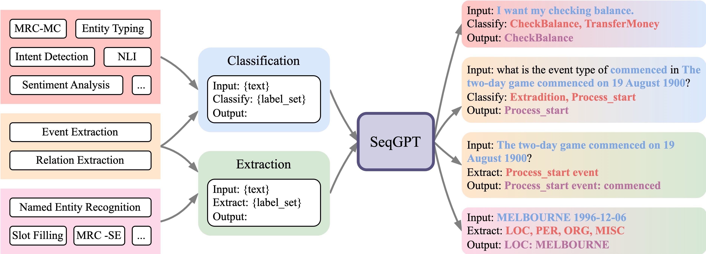
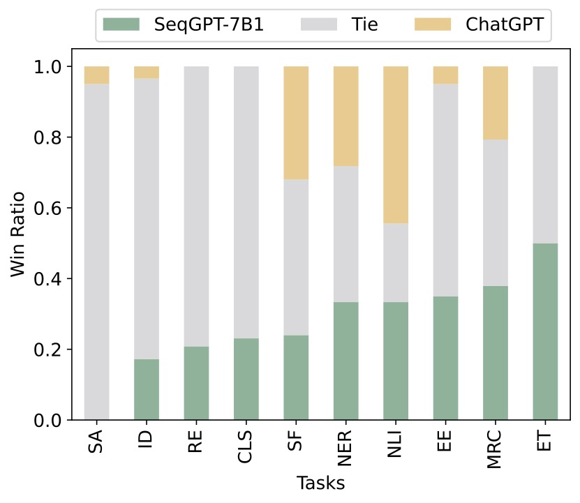

<div align="center">


## An Out-of-the-box Large Language Model for Open Domain Sequence Understanding

<div>
Tianyu Yu*, Chengyue Jiang*, Chao Lou*, Shen Huang*, Xiaobin Wang, Wei Liu, Jiong Cai, Yangning Li, Yinghui Li, Kewei Tu, Hai-Tao Zheng, Pengjun Xie, Fei Huang, Yong Jiang†
</div>
<div>
<strong>DAMO Academy, Alibaba Group</strong>
</div>
<div>
*Equal Contribution; † Corresponding Author
</div>
</div>

<div align="center">

[](./LICENSE)
[](https://arxiv.org/abs/2308.10529)

</div>

## Spotlights

<div align="center">

</div>
<br/>

* A bilingual model (English and Chinese) specially enhanced for open-domain NLU.
* Trained with diverse synthesized data and high-quality NLU dataset.
* Handle all NLU tasks that can be transformed into a combination of atomic tasks, classification and extraction.

## Performance

We perform a human evaluation on SeqGPT-7B1 and ChatGPT using the held-out datasets. Ten annotators are tasked to decide which model gives the better answer or two models are tied with each other. SeqGPT-7B1 outperforms ChatGPT on 7/10 NLU tasks but lags behind in sentiment analysis (SA), slot filling (SF) and natural language inference (NLI).
<div align="center">

</div>


## Checkpoints

We release the weight of SeqGPT-560M at both [Modelscope]() and [Hugging Face]().

## Usage

Install:

```sh
conda create -n seqgpt python==3.8.16

conda activate seqgpt
pip install -r requirements.txt
```

Inference:

```python
from transformers import AutoTokenizer, AutoModelForCausalLM, AutoModel
import torch

model_name_or_path = '<model_name_or_path>'
tokenizer = AutoTokenizer.from_pretrained(model_name_or_path)
model = AutoModelForCausalLM.from_pretrained(model_name_or_path)
tokenizer.padding_side = 'left'
tokenizer.truncation_side = 'left'

if torch.cuda.is_available():
    model = model.half().cuda()
model.eval()
GEN_TOK = '[GEN]'

while True:
    sent = input('输入/Input: ').strip()
    task = input('分类/classify press 1, 抽取/extract press 2: ').strip()
    labels = input('标签集/Label-Set (e.g, labelA,LabelB,LabelC): ').strip().replace(',', '，')
    task = '分类' if task == '1' else '抽取'

    # Changing the instruction can harm the performance
    p = '输入: {}\n{}: {}\n输出: {}'.format(sent, task, labels, GEN_TOK)
    input_ids = tokenizer(p, return_tensors="pt", padding=True, truncation=True, max_length=1024)
    input_ids = input_ids.to(model.device)
    outputs = model.generate(**input_ids, num_beams=4, do_sample=False, max_new_tokens=256)
    input_ids = input_ids.get('input_ids', input_ids)
    outputs = outputs[0][len(input_ids[0]):]
    response = tokenizer.decode(outputs, skip_special_tokens=True)
    print('BOT: ========== \n{}'.format(response))
```


## Citation

If you found this work useful, consider giving this repository a star and citing our paper as followed:

```
@misc{yu2023seqgpt,
      title={SeqGPT: An Out-of-the-box Large Language Model for Open Domain Sequence Understanding}, 
      author={Tianyu Yu and Chengyue Jiang and Chao Lou and Shen Huang and Xiaobin Wang and Wei Liu and Jiong Cai and Yangning Li and Yinghui Li and Kewei Tu and Hai-Tao Zheng and Ningyu Zhang and Pengjun Xie and Fei Huang and Yong Jiang},
      year={2023},
      eprint={2308.10529},
      archivePrefix={arXiv},
      primaryClass={cs.CL}
}
```